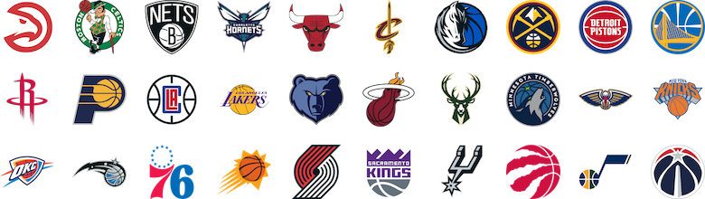
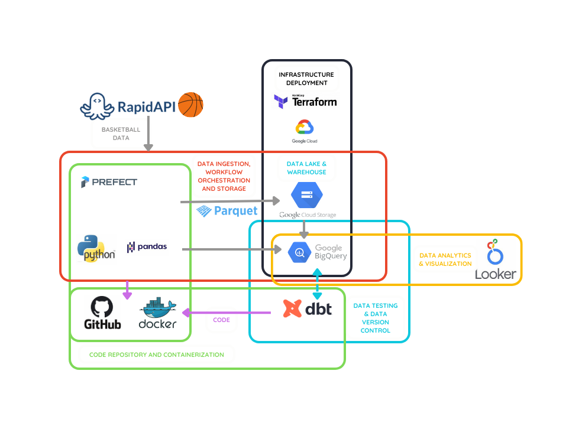
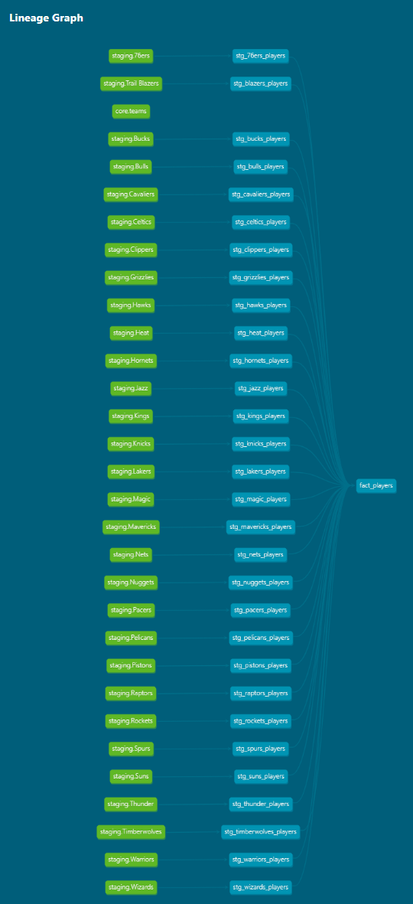
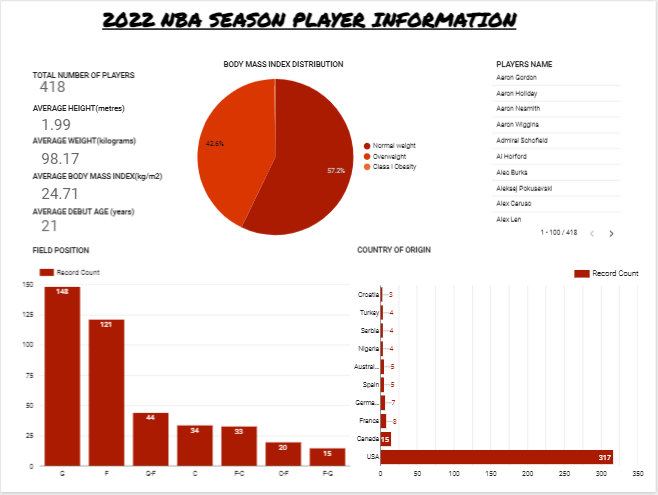
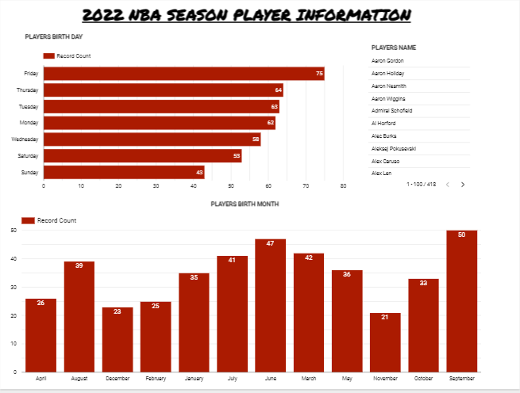

# NBA SEASON 2022 PLAYERS INFORMATION

This project was built over the course of the [2023 Data Engineering Zoomcamp](https://github.com/DataTalksClub/data-engineering-zoomcamp). The goal was to build a data pipeline that can continuously fetch, transform and load data into a data warehouse and visualize key insights. This was achieved with a batch data pipeline, and written in a way that allows for data mining via an [api](<(https://api-sports.io/documentation/nba/v2)>) given the year as a parameter.   
I also documented my entire 2023 Data Engineering Zoomcamp journey in a medium post [here](https://medium.com/@ologanj/my-journey-through-the-2023-data-engineering-zoomcamp-a35c77f54a66).
 
 

## NBA Season 2022
The NBA season 2022 began on October 19, 2021 and ended on April 10, 2022. The NBA All-Star Game was played at Rocket Mortgage FieldHouse in Cleveland on February 20, 2022. The Golden State Warriors defeated the Boston Celtics in the 2022 NBA Finals which ended on June 16.

 
 

## About the Dataset

The data was mined using an end-to-end orchestrated data pipeline, with [Rapid API](https://rapidapi.com/api-sports/api/api-nba/) as the source to extract teams and player details for NBA season 2022, and save the data to my data [lake](https://console.cloud.google.com/storage/) and warehouse [BigQuery](https://console.cloud.google.com/bigquery/) without much transformations. Then, dbt was used to clean and tranform the data extraxted as needed into staging and fact tables which was used for visualization in the dashboard.
 
 

## Questions this Project Seeks to Answer

- What is the average height of players?
- What is the average weight of players?
- What is the average body mass index of players?
- What is the body mass index class distribution of players?
- Which countries had the lowest representation of players?
- Which field positions have the highest and lowest distributions of players?
- Which day and month did most players celebrate their birthdays?
   
   

## Technologies Used

- [Pandas Python Library](https://pandas.pydata.org/): To fetch data from the [RAPID API](https://api-sports.io/documentation/nba/v2), transform it into a dataframe with appropriate data types, and load it to BigQuery
- [Terraform](https://www.terraform.io/): To easily manage infrastructure setup and changes
- [Docker](https://www.docker.com/): To containerize our code and get the flows ready for deployment on prefect agent
- [Google Cloud Storage](https://cloud.google.com/storage): To host our data from the Basketball Rapid api
- [Google BigQuery](https://cloud.google.com/bigquery): To host our data from the Basketball Rapid api
- [Google Looker Studio](https://lookerstudio.google.com/): To make our dashboard
- [Github](https://github.com/): To host our source code as well as for CI/CD with Github Actions
- [Prefect OSS and Prefect Cloud](https://www.prefect.io/): To orchestrate, monitor and schedule our deployments
- [dbt](https://www.getdbt.com/): To transform the data in our data warehouse and get it ready for visualization
   
   

## Structure of the Final Players Fact Table

| Column         | Data Type | Description                                  |
| -------------- | --------- | -------------------------------------------- |
| name | STRING | Unique key identifying a specific player |
| place_of_birth | STRING | Place of birth of each player |
| day_of_birth | STRING | Day of the week in which each player was born |
| month_of_birth | STRING | Month of the year in which each player was born |
| debut_age | INTEGER | Age at which each player had their debut |
| height | FLOAT | Height of each player |
| weight | FLOAT   | Weight of each player |
| BMI | FLOAT | Body mass index of each player |
| bmi_class | STRING | Body mass index class of each player |
| college | STRING | College each player is a affiliated to |
| jersey_number | INTEGER | Number on the jersey worn by each player |
| position | STRING | Field position played by each player |

 
 

## dbt Lineage Graph

The lineage graph for the final players Fact Table looks like this:

 
 

`teams_lookup` is a parquet file created which contains details about each team like their names, nickname, code, nba franschise, and so on.
 
 
The `nbaplayers`.`table` dataset was created in [BigQuery](https://cloud.google.com/bigquery) to hold the tables of all the players for each team using their nicknames for table names. `stg_table_players` contains cleaned up and standardized data from the `nbaplayers`.`table` table with a filter applied to remove null jersey numbers and incorrect debut years
 
`stg_table_players` were joined together into final `fact_players` table that feeds the dashboard.
 
 
The `fact_players` table which feeds the dashboard, contains all players details as well as their calculated body mass index and class using a macro within dbt

 
 

## Dashboard Preview

You can explore the final dashboard [here](https://lookerstudio.google.com/reporting/65ee32b0-4626-4a39-8065-5d8c27380a1a).

 
 

## Key Findings

- At least 418 players participated in the 2022 NBA season.
- The average height of the athletes was 199cm, and average weight was 98.17kg
- Most athletes were within the normal weight class for their respective body mass index, with an average of 24.71kg/m2.
- Many of the players who participated debuted at 21 years of age.
- There were more guards in the NBA than centres.
- There were about 3 Croatian athletes who played in the 2022 season.
- There were more players who had their birthdays on a Friday and most of them were born in September.
   
   

## To Replicate

1. Go through the prerequisite steps [here](./replicate.md)

 
 

## Future Improvements

- Adding comprehensive tests to ensure data quality, pipeline reliability, and overall performance
- Exploring the possibility of integrating other data sources to enhance the analysis and provide more in-depth insights into the NBA players' statistics
- Investigating real-time data processing techniques to enable the system to react quickly to new data, providing up-to-date insights and more accurate analysis

## Inspirations:
Special thanks to [VeraZab](https://github.com/VeraZab/nyc-stats/tree/main/), [mikecolemn](https://github.com/mikecolemn/mpls-311-data/tree/main/), and [VincenzoGalante](https://github.com/VincenzoGalante/magic-the-gathering/tree/main/), for their projects, as it served as a useful guides in working on this project.